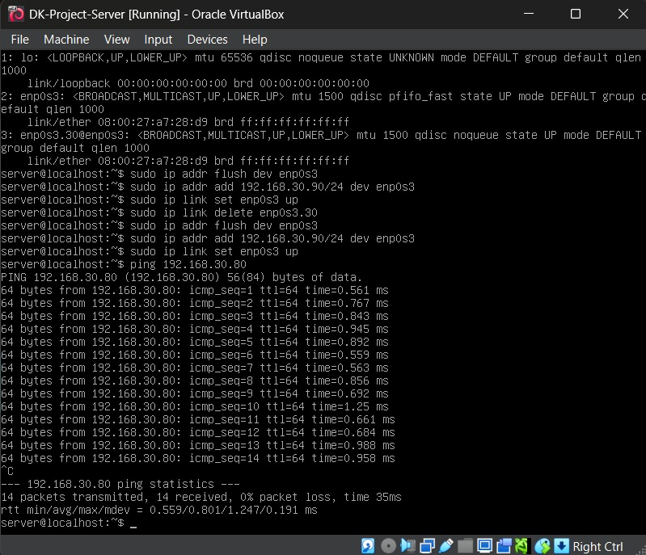
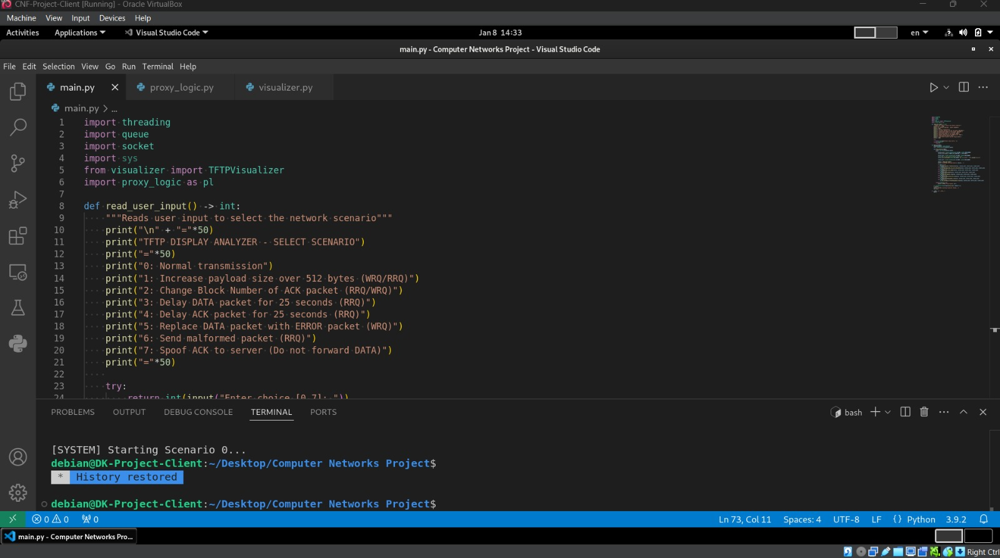
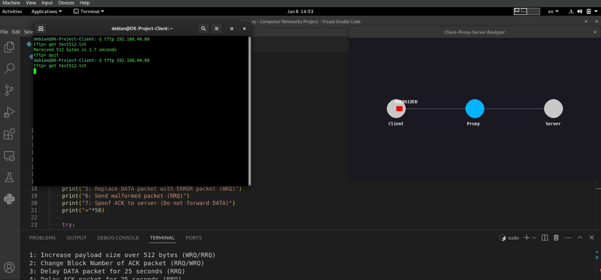

# Cisco Copycat

## Project Overview
**Cisco Copycat** is a specialized tool for automating and documenting Cisco device configurations. This project combines Python-based automation scripts with a detailed visual guide to ensure network replication is consistent and error-free.

---

## Pre-Run Setup
To avoid connection issues and common network errors, ensure your environment is configured as follows:

### Interface Configuration
If you are using temporary IP addresses or working within a virtual environment (like GNS3 or a Linux-based jump host), you may encounter **`Errno 99: Cannot assign requested address`**. This usually happens when the script tries to bind to an interface that isn't properly initialized.

Run the following commands to ensure `eth0` is ready:
1. Assign the Client-side IP
```bash
sudo ip addr flush dev eth0
sudo ip addr add 192.168.40.80/24 dev eth0
sudo ip addr add 192.168.30.80/24 dev eth0
sudo ip link set eth0 up
```

2. Assign the Server-Side IP
```bash
sudo ip addr flush dev enp0s3
sudo ip addr add 192.168.30.90/24 dev enp0s3
sudo ip link set enp0s3 up
```

3. Verify before running (on Client):
```bash
ping -c 3 192.168.30.90
```

### Python Implementation

The following scripts are included in this repository to handle the automation logic:

main.py: The entry point for the replication process.
proxy_logic.py: The "Man-in-the-Middle" engine that intercepts raw TFTP packets, parses Opcodes (RRQ - READ REQUEST, WRQ - WRITE REQUEST, DATA, ACK), and handles forwarding.
visualizer.py: A pygame-based engine that renders a real-time animation of the network topology (Client ↔ Proxy ↔ Server).

### Supported Attack Scenarios

Oversized Payloads: Appends data to packets to exceed 512 bytes.
Block Number Manipulation: Modifies ACK numbers to desync the transfer.
Latency Simulation: Introduces 25-second delays to trigger protocol timeouts.
Error Injection: Swaps valid DATA packets with TFTP ERROR codes.
Normal Transmision (Scenario 0): While not an attack pattern, this simulates a normal packet transmission from Client to Server.

### How to Run

1. In VSCode Terminal, run "sudo python3 main.py".
2. Select desired scenario.
3. Open a Linux terminal, where you run "tftp 192.168.40.80" to enter a TFTP transmission.
4. Run put/get test512.txt (for WRQ/RRQ transmissions)
5. Wait for the packet analyzer to finish and observe the results.

### Visual Documentation

[
[
[
<p align="center">
  <video src="https://github.com/theac-04/cisco-copycat/blob/main/assets/v1.mp4?raw=true" width="100%" controls>
  </video>
</p>
[Scenario 1 Run](assets/v2.mp4)
[Scenario 3 Run](assets/v3.mp4)

---

### Authors

Theodora-Mihaela Cimpoeru & Cristian Radu
